## 포트폴리오 취업 연계 관리 사이트 [스페이스] - space

 

 

## 📑 프로젝트 개요
다양한 취업 정보를 한 눈에 보기 편하게 제공하고 자신에게 적합한 취업공고를 찾도록 도와주며, 개인 포트폴리오를 효과적으로 관리할 수 있는 사이트 개발  
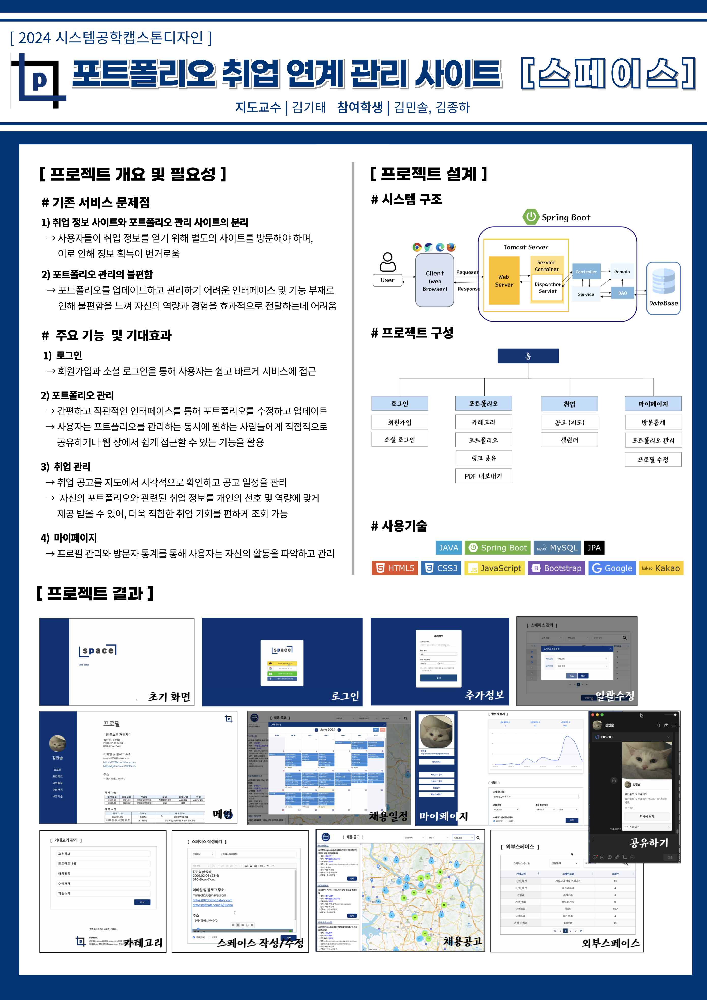  
 

## 💻 프로젝트 구현

### [ 초기화면 ]
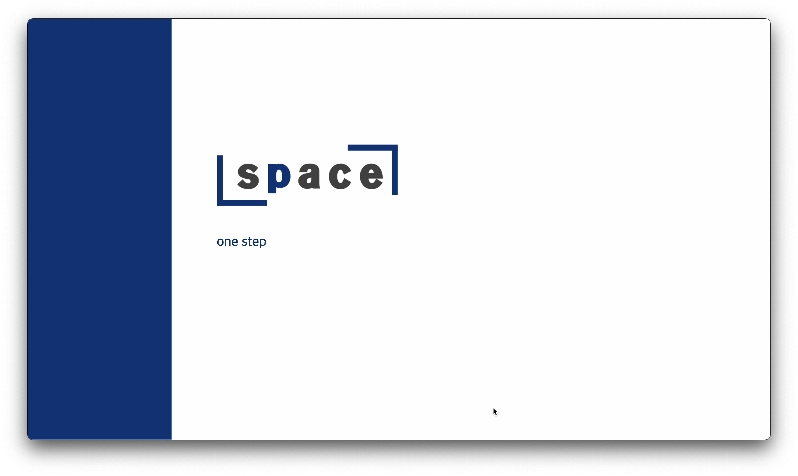
 

### [ 로그인 (회원가입) ]
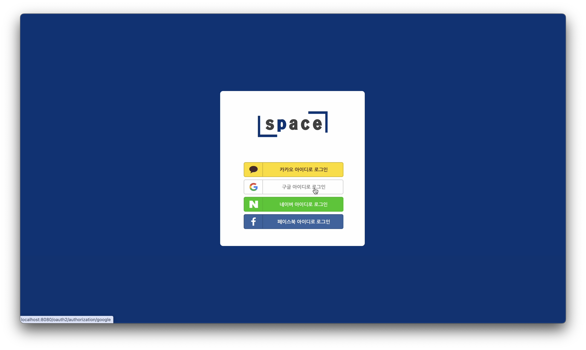
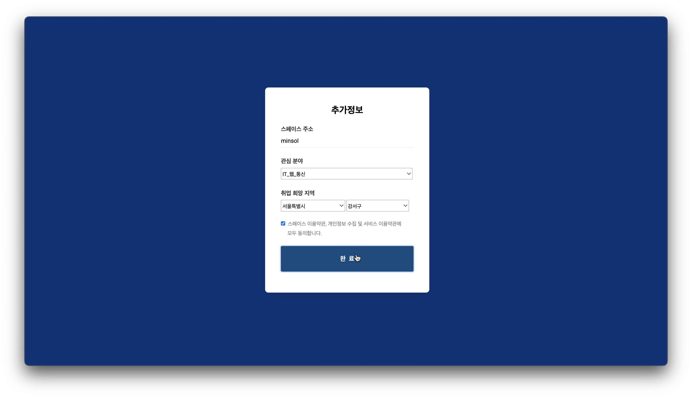
 

### [ 메인 ]
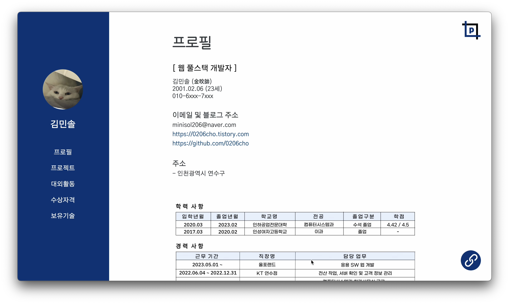
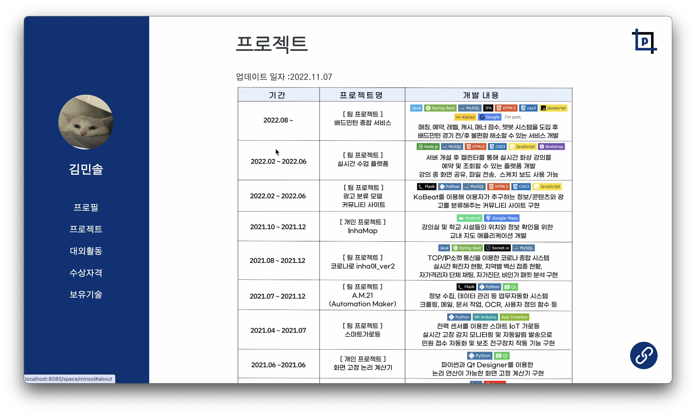
 

### [ 마이페이지 ]
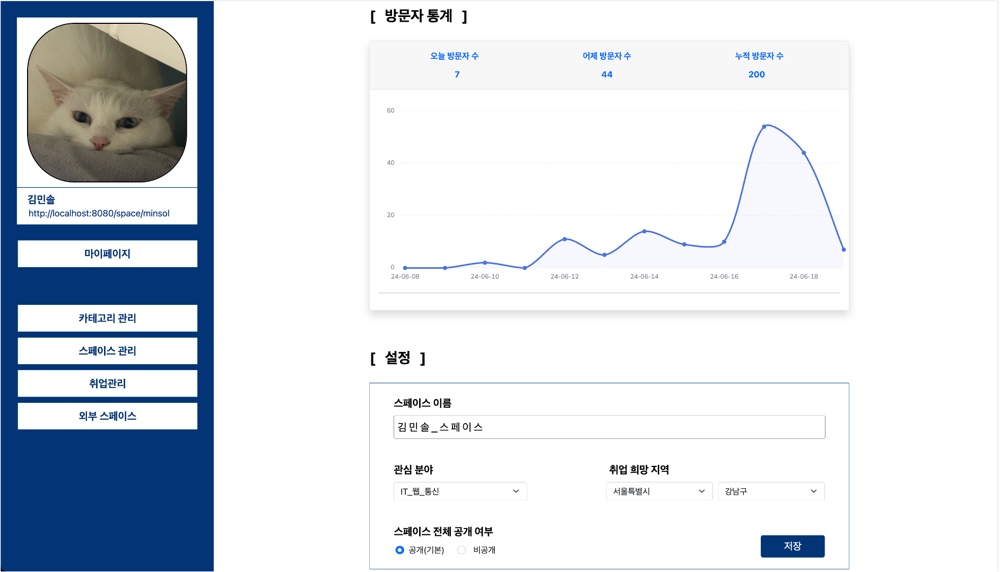
 

### [ 카테고리 관리 ]
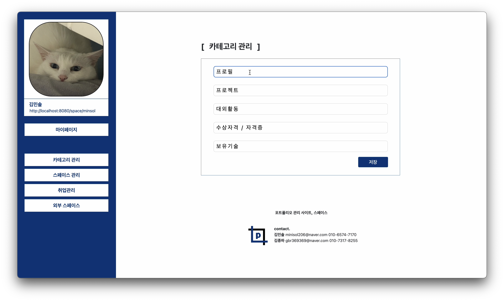
 

### [ 스페이스 관리 ]
스페이스 목록   
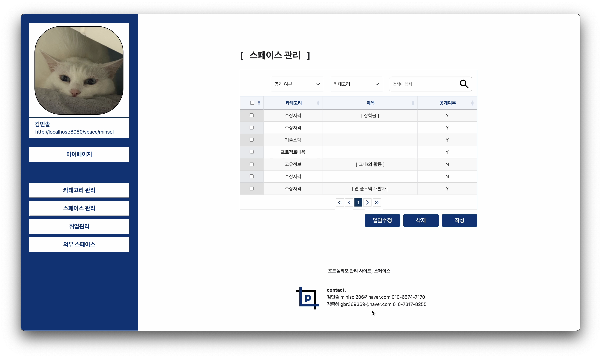

스페이스 작성  
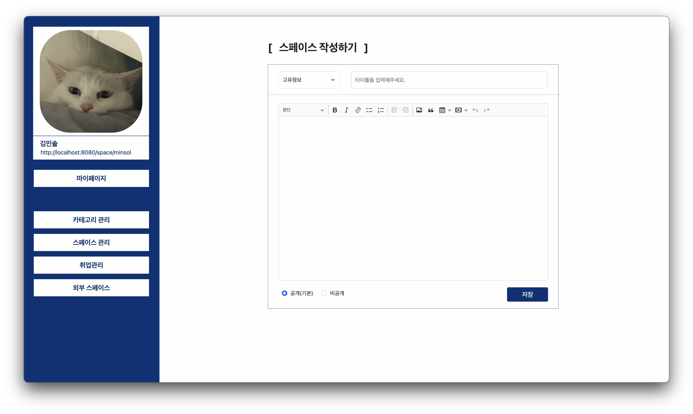

스페이스 상세 조회 (수정)  
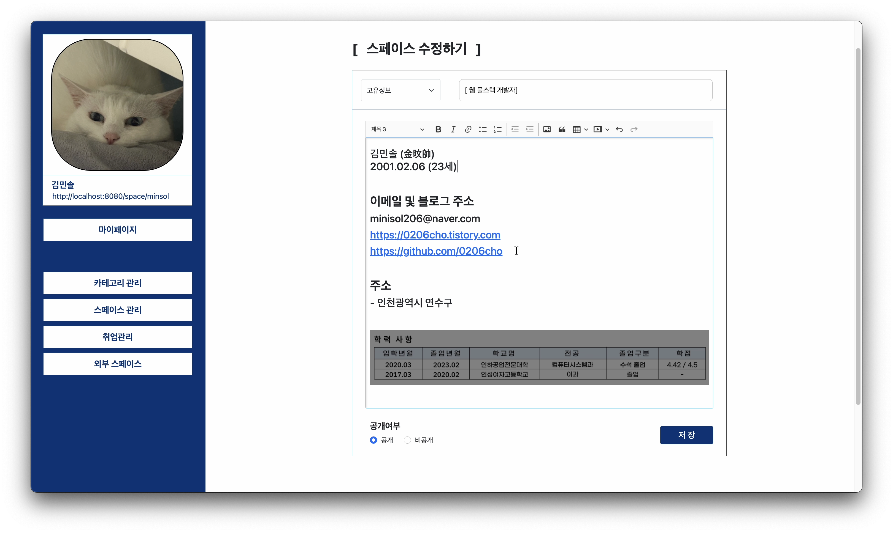
 

### [ 외부 스페이스 ]
외부 스페이스 목록  
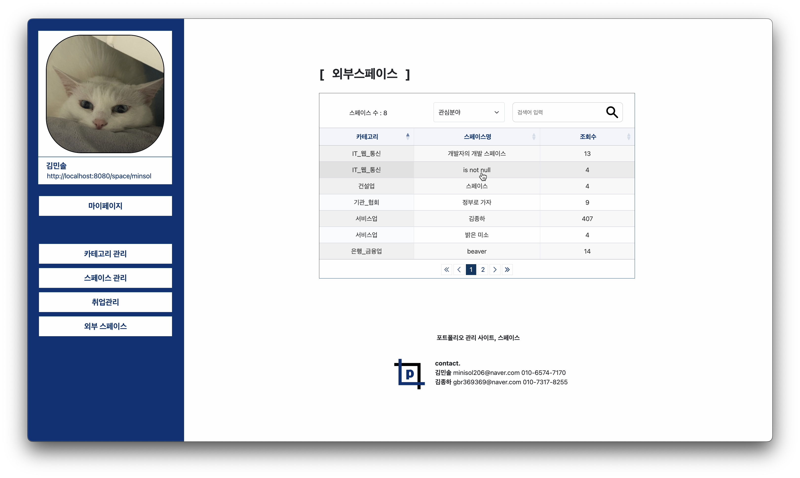

비공개 스페이스 접근  

공개된 스페이스 접근  

### [ 스페이스 공유 ]
카카오톡 공유하기  
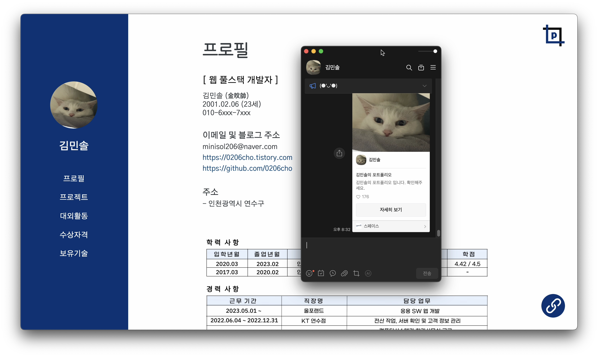

PDF 내보내기  
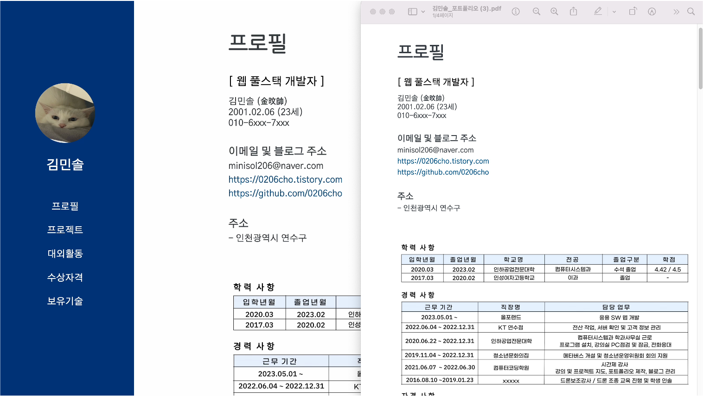
 

### [ 취업관리 ]
취업 공고  
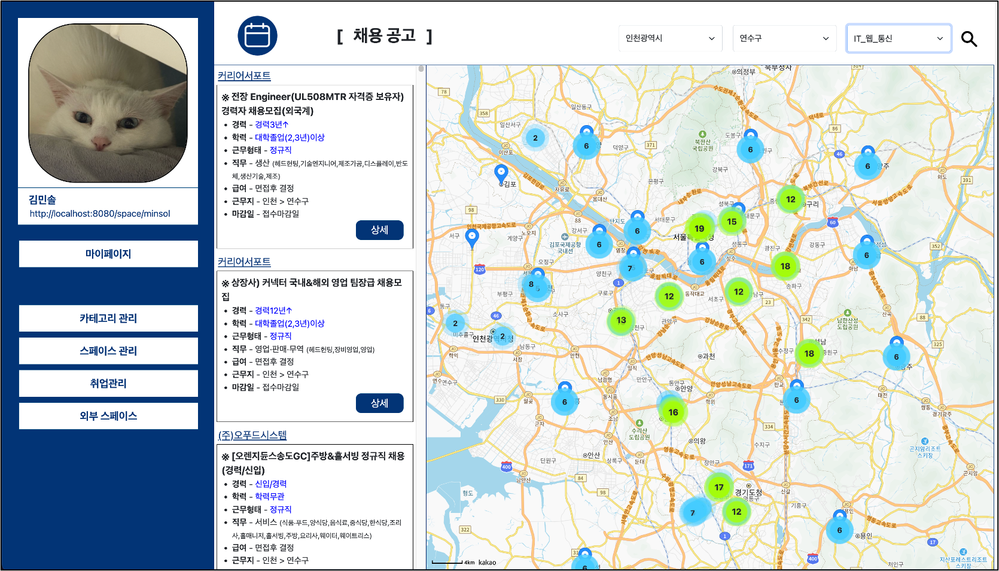

채용 일정  
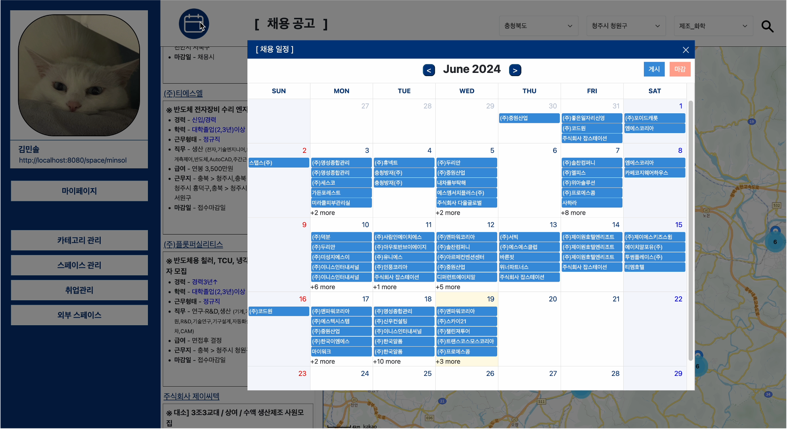
 

